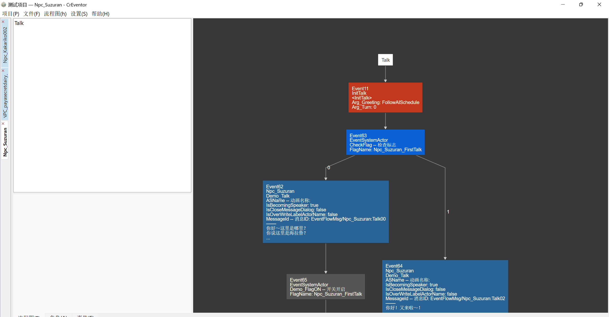
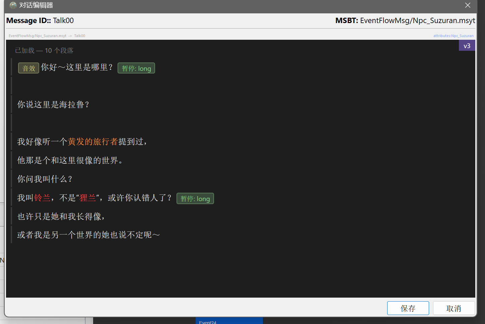
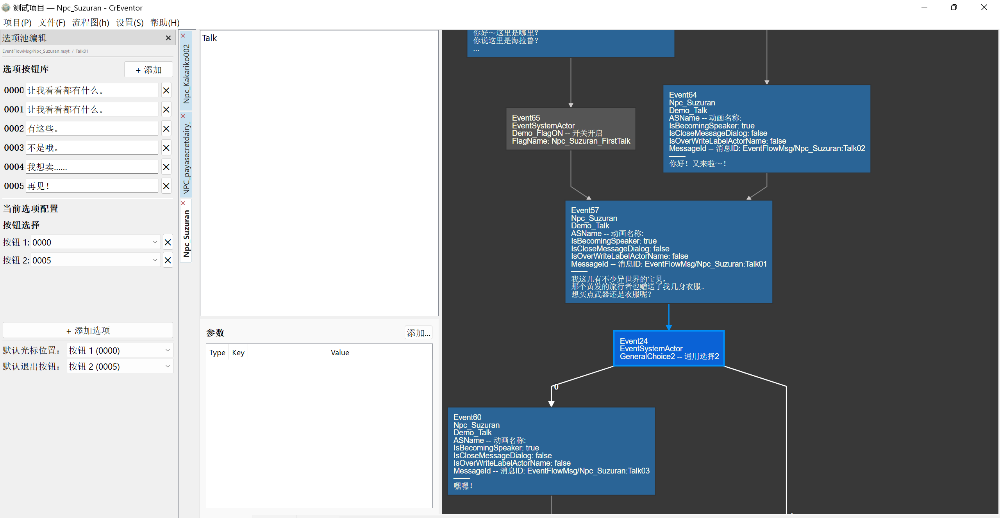
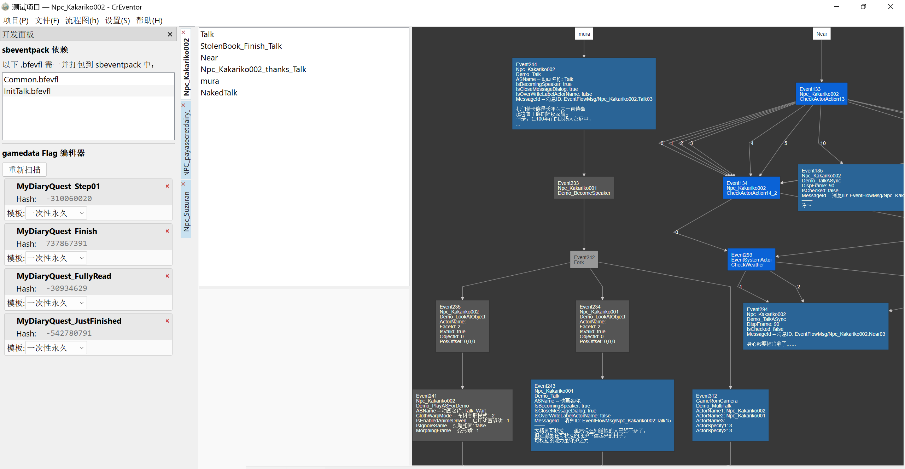
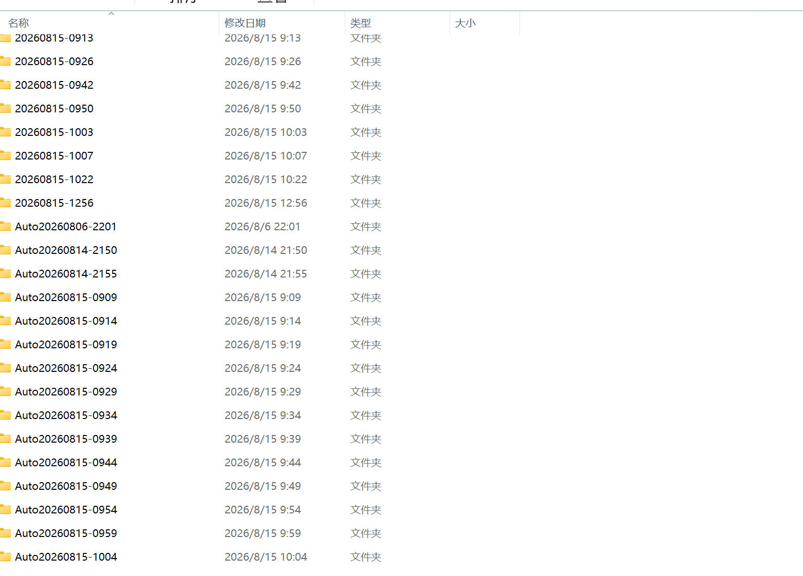
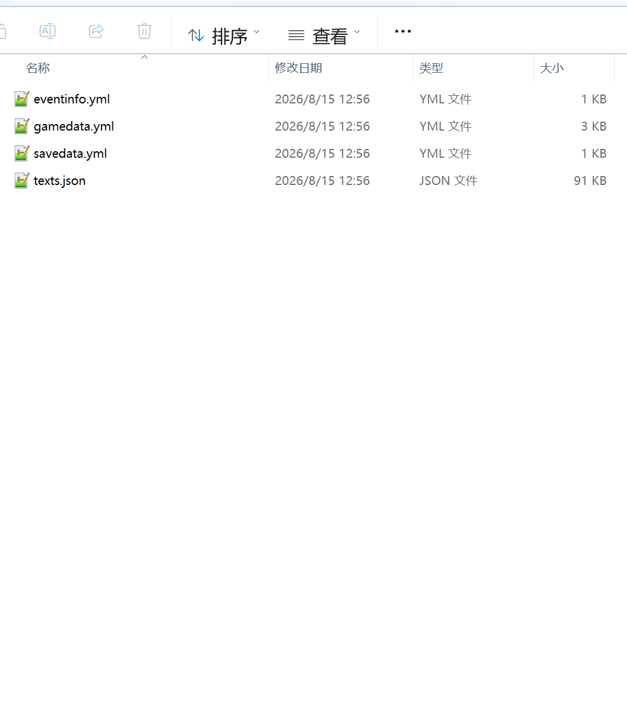
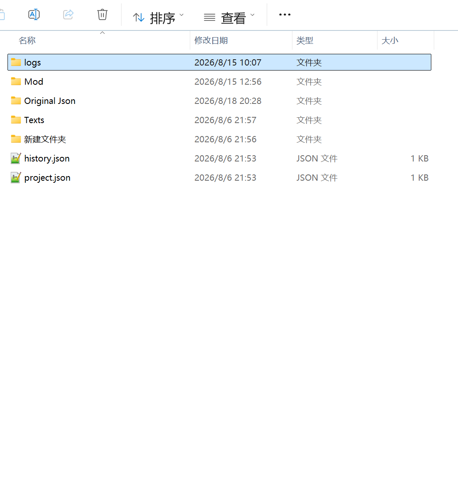

# CrEventor

<p align="center">
  
</p>

> 塞尔达传说：旷野之息（The Legend of Zelda: Breath of the Wild）Mod 制作综合事件流（EventFlow）开发工具

**项目仓库**：https://github.com/Rongyaoyaoooooo/CrEventor

简体中文 · [English](./README.en.md)

CrEventor 是一款基于 [leoetlino/event-editor](https://github.com/leoetlino/event-editor) 深度二次开发的《旷野之息》事件流编辑器。它在保留原版流程图可视化编辑能力的基础上，重点强化了**中文本地化**、**gamedata 与 savedata 生成**、**eventinfo 注册**、**包含 control 字段的文本深度高级编辑**、**选项池（GeneralChoice）** 等能力，面向**系统化 Mod 制作**场景。



---

## 功能特性

- **多流程标签页工作区**：同时打开多个事件流（.bfevfl），支持关闭、重命名、拖拽排序。
- **完整 JSON 往返序列化**：EventFlow 可无损转换为 JSON 并重建为二进制（.bfevfl），便于版本管理与人工作业。
- **中文本地化（CNzh）**：面向中文剧情制作，支持文本提取、编辑与覆盖层独立保存。
  > 注意：发布版出于规避版权问题的考虑，**不内置任何游戏文本**，请自行准备从游戏提取的文本数据（详见下方「使用说明」）。
- **文本深度高级编辑**：支持对 MSBT 中 `control` 字段的可视化编辑，涵盖 `set_colour` / `font` / `text_size` / `sound` / `pause` / `choice` 等十余种控制类型。

  

- **选项池（Option Pool / GeneralChoice）编辑器**：按 MSBT 管理对话按钮库，支持为每个对话节点配置按钮、光标、取消项。
  - 自动识别 `GeneralChoice{N}` 节点（SwitchEvent / ActionEvent / ForkEvent 三种形态）。
  - `unknown = 2n + 2` 字段公式，经 2400+ 真实样本验证。
  - 选项配置自动写入所有指向同一选项节点的父级 Talk 消息。

  

- **gamedata 与 savedata 生成**：从事件流中提取并生成游戏数据、存档数据等产物。
- **eventinfo 注册**：生成事件信息，便于事件流的注册与识别。
- **游戏数据编辑（sbeventpack + 标志位）**：事件包依赖分析，Bool / S32 / String 标志卡交互式编辑。

  

- **项目化管理**：创建 / 打开项目，定时自动保存，关键操作自动备份，支持手动与自动备份恢复。
- **中英双语界面**：菜单、面板、对话框完整国际化（`zh_CN` / `en_US`），运行时切换。
- **平台 / 语言切换**：Switch / WiiU 平台切换，游戏文本语言选择。

---

## 重要声明（请务必阅读）

> **本项目基于个人制作经验开发，不代表标准的 Mod 制作流程。**

在使用本工具之前，请先详细阅读 [Zeldamods Wiki](https://zeldamods.org/) 的基础教程，确保你对《旷野之息》的 Mod 项目结构、各个文件的作用与规范有一定理解，并具备一定制作经验后再使用本工具。再次强调：本工具出于个人使用习惯与开发简易的考虑而制作，**不代表标准 Mod 制作流程**。

- **版权规避**：发布版**不内置任何游戏中文文本**，以避免版权问题。
- **未完整测试**：本工具尚未进行大型项目的完整测试，建议在使用时勤加手动备份。遇到任何 Bug，欢迎记录并反馈。
- **保存即备份**：任何一次保存都是一次备份，**不会覆盖之前的保存**。请按照保存时间查找备份；如有需要，可在菜单中恢复备份。

  

- **备份 JSON 已弃用**：备份 JSON 只会备份事件流的 JSON。出于某些原因，该功能现已弃用，后续可能会重新调整其逻辑并重新启用。目前，对于因使用「备份 JSON」功能而导致的数据丢失，我们**不负责任**。

---

## Mod 打包流程

本项目生成的文件需要手动打包为最终 Mod：

1. 将项目内生成的事件流文件，依照所需依赖**手动打包为 sbeventpack**。
2. 使用 [BCML](https://github.com/NiceneNerd/BCML) 将其**打包为 BNP**。
3. 将 BNP **解压缩**。
4. 将项目文件夹 `logs/` 中的文件**置入解压出的 BNP** 中。
5. 得到的即为**完整的 Mod 文件**。

---

## 配套工具

- **QuestEditor**：配套的任务编辑器，目前**尚在测试阶段**，将在开发完毕后另行发布。

---

## 技术栈

| 类别 | 技术 |
|---|---|
| 语言 | Python 3.11 |
| GUI | PyQt5 + PyQtWebEngine（流程图渲染） |
| 事件流解析 | [evfl](https://github.com/leoetlino/evfl) 1.2.0 |
| 二进制 I/O | aamp / byml / rstb / oead |
| 序列化 | msgpack / PyYAML |
| 基础框架 | [leoetlino/event-editor](https://github.com/leoetlino/event-editor)（GPL-2.0-or-later） |

---

## 目录结构

```
CrEventor/
├── launch.py                   # 入口（Qt DLL 修复 + import 路径配置 → main()）
├── requirements.txt            # 运行时依赖
├── CrEventor/          # ★ 所有自定义代码
│   ├── __main__.py             # 主窗口（枢纽）
│   ├── option_pool_panel.py    # M 面板：选项池 + 对话选项配置
│   ├── side_panel.py           # N 面板：sbeventpack + 游戏数据
│   ├── text_database.py        # 文本数据库：加载 / 合并 / 保存 / 查询
│   ├── project_manager.py      # 项目生命周期 + 备份管理
│   ├── flow_tab_bar.py         # 多流程标签页
│   ├── export_utils.py         # EventInfo / GameData / SaveData 导出
│   ├── sbeventpack_analyzer.py # 事件包依赖分析
│   ├── gamedata_editor.py      # 标志卡编辑器
│   ├── text_editor_dialog.py   # 文本高级编辑（control 字段）集成
│   ├── i18n/                   # 国际化（zh_CN / en_US）
│   └── resources/texts/        # 文本资源（发布版不含内置中文文本）
├── TextEditor/                 # 基于 ProseMirror 的消息编辑器
├── event-editor-master/        # 上游基础框架（勿直接修改）
└── docs/                       # 截图
```

> 发布版不包含文本资源，请自行设法获取。

---

## 快速开始（Windows）

### 方式一：下载发布版（推荐）

1. 前往 [Releases](https://github.com/Rongyaoyaoooooo/CrEventor/releases) 下载最新版 `CrEventor-*.zip`。
2. 解压到任意目录（建议路径不含中文、空格）。
3. 运行解压目录中的 `CrEventor.exe`。

### 方式二：从源码运行

#### 环境要求

- Windows（建议项目路径不含中文、空格，以避免 Qt DLL 加载问题）
- Python 3.11（64 位）

#### 安装

```powershell
# 1. 进入项目目录
cd "项目路径"

# 2. 创建虚拟环境
python -m venv venv
.\venv\Scripts\Activate.ps1

# 3. 安装依赖
pip install -r requirements.txt
```

> 说明：`aamp` / `byml` / `rstb` / `oead` 为平台相关二进制包（部分为 `.whl` / `.pyd`），
> 请根据现有 venv 或对应 wheel 文件安装。

#### 启动

```powershell
# 直接运行
.\venv\Scripts\python.exe launch.py

# 以模块方式运行
.\venv\Scripts\python.exe -m CrEventor
```

---

## 使用说明

### 1. 准备原版文本

请按照 **BCML 使用的格式**，获取原版游戏的全部文本 `texts.json`，放置到 `CrEventor/resources/texts/` 下的对应平台目录中，用于调用原版文本：

- Switch：`resources/texts/switch/`
- WiiU：`resources/texts/wiiu/`

### 2. 提取文本

在**设置菜单内执行「提取文本」**，可以自动加载本项目用到的原版 Event 的文本。

### 3. 平台说明

设置内的「平台」选项，**在本版本中仅影响最终生成的 Mod 结构，不影响实际内容**。

### 4. 基本工作流

1. **新建 / 打开项目**：通过菜单创建项目，或打开已有项目目录。
2. **编辑事件流**：在流程图中增删改事件节点，右侧编辑事件属性。
3. **编辑对话文本**：在左侧选择 Talk 节点，右侧编辑对话内容（含 `control` 字段高级编辑）。
4. **配置对话选项**：按 `M` 打开选项池面板，为 GeneralChoice 节点配置按钮、光标与取消项；按 `N` 打开游戏数据面板。
5. **保存**：`Ctrl+S` 手动保存；系统定时自动保存；每次保存都会生成独立备份，不覆盖历史。
6. **打包 Mod**：按上文「Mod 打包流程」手动打包为 sbeventpack → BNP，并置入 `logs/` 产物。

### 5. 文本编辑操作

- 在文本编辑窗口中，**选中文本后右键**，可以设置**字体、字号与颜色**；其中**字体不能与另外两种（字号、颜色）叠加**使用。
- 在**光标处右键**，可以添加其他 `control` 模块。

### 6. 与 AI 工具协作

你可以把导出的 JSON 交给 AI 工具处理，再导入回 CrEventor 使用；对于格式错误的 JSON，工具会**拒绝导入**。

> AI 辅助功能在**本版本中尚未加入**，将在后续版本更新，届时需要用户提供合法的游戏数据。

### 7. 导出产物（logs）

保存或导出后，可在项目 `logs/` 目录下得到 `eventinfo` / `gamedata` / `savedata` / `texts.json` 等产物。



### 项目数据目录约定

```
{project}/
├── project.json                # 项目元数据
├── Texts/                      # 提取的原始文本（只读基线）
├── Original Json/              # 所有修改 + 备份
│   ├── {datetime}/             # 手动备份
│   ├── AutoBackup{...}/        # 操作触发备份
│   └── Auto{date}/             # 定时自动保存
├── Mod/                        # BCML 兼容输出
└── logs/                       # 导出产物（eventinfo / gamedata / savedata / texts）
```



---

## 常见问题

- **Qt DLL 找不到 / 中文路径报错**：`launch.py` 已通过 `os.add_dll_directory()` 修复，建议将项目移动到不含中文的路径。
- **QWebEngine 崩溃 / 白屏**：已设置 `QTWEBENGINE_DISABLE_SANDBOX=1`；调试时可加 `--debug` 参数开启远程调试（端口 9222）。
- **缺少 `_version.py`**：该模块由 versioneer 自动生成，如缺失可手动创建最小版本模块。

---

## 许可证

本项目基于 [leoetlino/event-editor](https://github.com/leoetlino/event-editor)（GNU GPL v2 或更高版本）衍生开发，因此同样采用 **GNU General Public License v2 或更高版本（GPL v2+）** 授权。详见 [LICENSE](./LICENSE)。

本项目所使用的第三方库及其许可证、致谢详见 [THIRD_PARTY_LICENSES.md](./THIRD_PARTY_LICENSES.md)。

---

## 致谢

- [leoetlino/event-editor](https://github.com/leoetlino/event-editor)：原始事件流编辑器框架
- [leoetlino/evfl](https://github.com/leoetlino/evfl)：EventFlow 解析库
- [ProseMirror](https://prosemirror.net/)（MIT License）：文本编辑器底层框架
- [Zeldamods Wiki](https://zeldamods.org/)：Mod 制作文档与规范
- 以及 aamp / byml / rstb / oead 等 Nintendo 二进制 I/O 库的开发者
